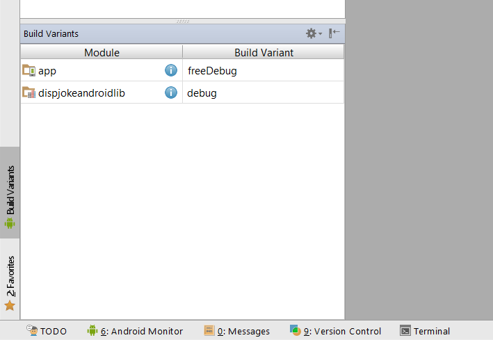

# BuildItBigger
An Android app that retrieves jokes from Google Cloud Endpoints module and displays them via an Activity from the Android Library. This app has multiple flavors (free and paid) that uses multiple libraries and Google Could Endpoints. It also has functional tests.

The app consists of four modules:
* A Java library that provides jokes
* A Google Could Endpoints (GCE) project that serves those jokes
* An Android Library containing an activity for displaying jokes
* An Android app that fetches jokes from the GCE module and passes them to the Android Library for display

This is a part of Android Nanodegree project. This project is a part of Udacity Android Nanodegree.

## How to use it?
Download the free or paid app from [here](https://github.com/DevipriyaSarkar/BuildItBigger/releases).

## Setup
1. Clone/download the repository.
2. Configuring the GCE Module:
 1. For running the backend locally - 
	1. Un-comment the following code in this [file] (app/src/main/java/com/udacity/gradle/builditbigger/EndpointsAsyncTask.java) that says "for local server"  
	
		```java  
		JokeApi.Builder builder = new JokeApi.Builder(AndroidHttp.newCompatibleTransport(),
                        new AndroidJsonFactory(), null)
                        // options for running against local devappserver
                        // - 10.0.2.2 is localhost's IP address in Android emulator
                        // - turn off compression when running against local devappserver
                        .setRootUrl("<your-local-ip-address>:8080/_ah/api/")	// eg. "http://192.168.1.148:8080/_ah/api/"
                        .setGoogleClientRequestInitializer(new GoogleClientRequestInitializer() {
                            @Override
                            public void initialize(AbstractGoogleClientRequest<?> abstractGoogleClientRequest) throws IOException {
                                abstractGoogleClientRequest.setDisableGZipContent(true);
                            }
                        });
		```
	2. 	Put your local IP address instead of ```<your-local-ip-address>```. It can be obtained by  
		On Windows, run ipconfig on command prompt and note down the IPv4 Address <ip-address>.  
		On Linux, run ifconfig instead.
	3. Comment that following code in the same [file] (app/src/main/java/com/udacity/gradle/builditbigger/EndpointsAsyncTask.java) that says "after deploying to App Engine"  
	
		```java  
		JokeApi.Builder builder = new JokeApi.Builder(AndroidHttp.newCompatibleTransport(), new AndroidJsonFactory(), null)
                    .setRootUrl("https://<your-android-app-backend>.appspot.com/_ah/api/");
		```
	4. Follow the instructions [here] (https://github.com/GoogleCloudPlatform/gradle-appengine-templates/tree/master/HelloEndpoints#11-debugging-the-backend-locally) to run the backend
 2. For deploying the backend live to App Engine - 
	1. Follow the instructions [here] (https://github.com/GoogleCloudPlatform/gradle-appengine-templates/tree/master/HelloEndpoints#22-deploying-the-backend-live-to-app-engine)
	2. Comment the following code in this [file] (app/src/main/java/com/udacity/gradle/builditbigger/EndpointsAsyncTask.java) that says "for local server"  
	
		```java  
		JokeApi.Builder builder = new JokeApi.Builder(AndroidHttp.newCompatibleTransport(),
                        new AndroidJsonFactory(), null)
                        // options for running against local devappserver
                        // - 10.0.2.2 is localhost's IP address in Android emulator
                        // - turn off compression when running against local devappserver
                        .setRootUrl("<your-local-ip-address>:8080/_ah/api/")	// eg. "http://192.168.1.148:8080/_ah/api/"
                        .setGoogleClientRequestInitializer(new GoogleClientRequestInitializer() {
                            @Override
                            public void initialize(AbstractGoogleClientRequest<?> abstractGoogleClientRequest) throws IOException {
                                abstractGoogleClientRequest.setDisableGZipContent(true);
                            }
                        });
		```
	3. Un-comment that following code in the same [file] (app/src/main/java/com/udacity/gradle/builditbigger/EndpointsAsyncTask.java) that says "after deploying to App Engine"  
	
		```java  
		JokeApi.Builder builder = new JokeApi.Builder(AndroidHttp.newCompatibleTransport(), new AndroidJsonFactory(), null)
                    .setRootUrl("https://<your-android-app-backend>.appspot.com/_ah/api/");
		```
		where ```<your-android-app-backend>``` corresponds to your own Project ID created in step 1.
	4.  Update this [file](backend/src/main/webapp/WEB-INF/appengine-web.xml)'s <application> property and replace myApplicationId with same Project ID that you just created in step 1.
 
3. Choose the required build variant and run  
	

## License
The content of this repository is licensed under [MIT LICENSE](LICENSE.MD).
